---
## Front matter
lang: ru-RU
title: Лабораторная работа 1
subtitle: Математическое моделирование
author:
  - Голощапов Ярослав Вячеславович
institute:
  - Российский университет дружбы народов, Москва, Россия
date: 15 февраля 2025

## i18n babel
babel-lang: russian
babel-otherlangs: english

## Formatting pdf
toc: false
toc-title: Содержание
slide_level: 2
aspectratio: 169
section-titles: true
theme: metropolis
header-includes:
 - \metroset{progressbar=frametitle,sectionpage=progressbar,numbering=fraction}
---

# Информация

## Докладчик

:::::::::::::: {.columns align=center}
::: {.column width="70%"}

  * Голощапов Ярослав Вячеславович
  * студент 3 курса
  * Российский университет дружбы народов
  * [1132222003@pfur.ru](mailto:1132222003@pfur.ru)
  * <https://yvgoloschapov.github.io/ru/>

:::
::: {.column width="30%"}

:::
::::::::::::::

## Цель работы

Приобретение навыков работы с git

## Задание

Получить практические навыки на примерах

# Выполнение лабораторной работы

## Создаем страницу hello, world.

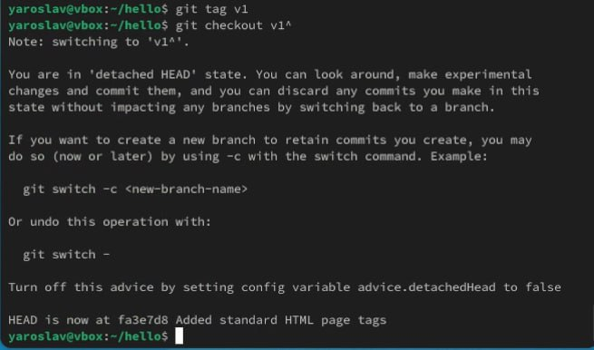{#fig:001 width=70%}

## Внесение изменений в созданную страницу.

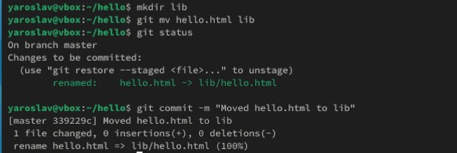{#fig:002 width=70%}

## Индексация и коммит изменений.

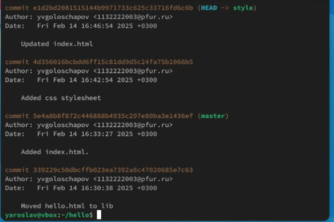{#fig:003 width=70%}

## Получение старых версий и создание тегов ( 

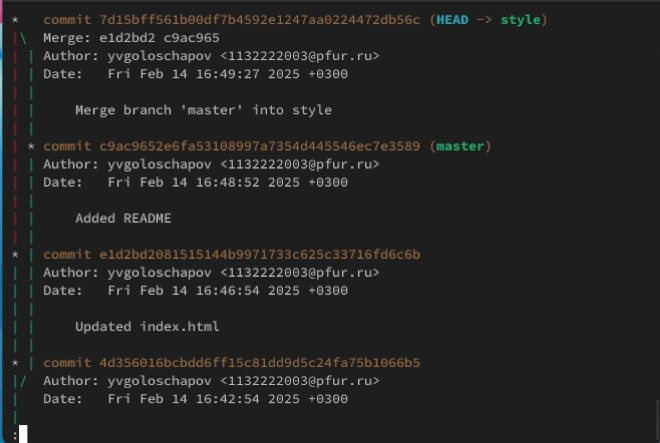{#fig:004 width=70%}

## Отмена локальных изменений (до индексации) 

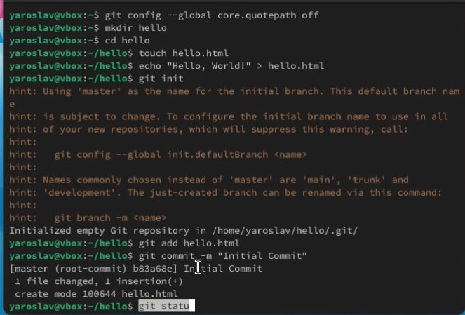{#fig:005 width=70%}

## Отмена проиндексированных изменений (перед коммитом) 

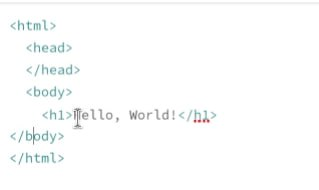{#fig:006 width=70%}

## Отмена коммитов

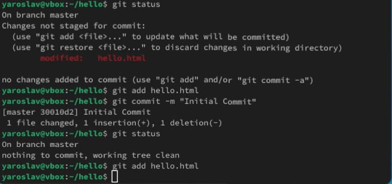{#fig:007 width=70%}

## Удаление коммиттов из ветки

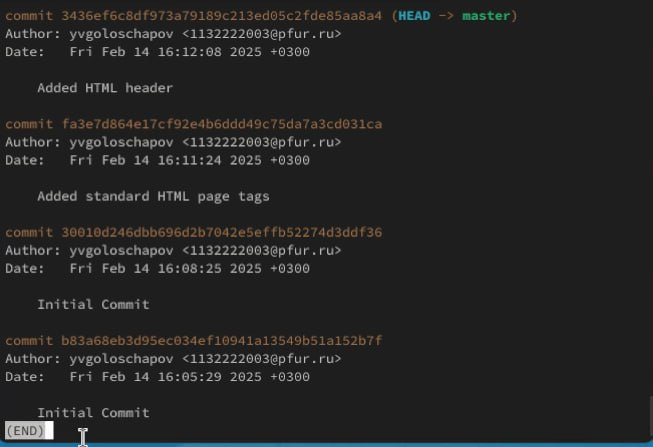{#fig:008 width=70%}

## Удаление тега oops 

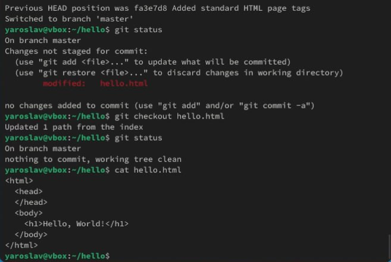{#fig:009 width=70%}

## Внесение изменений в коммиты

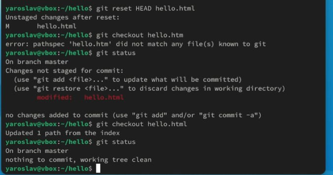{#fig:010 width=70%}

## Перемещение файлов

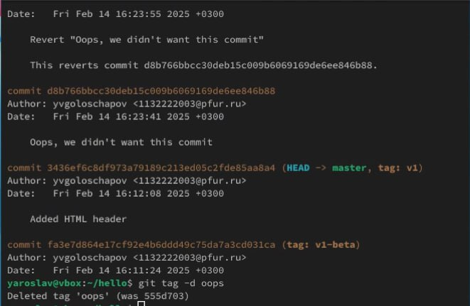{#fig:011 width=70%}

## Второй способ перемещения файлов

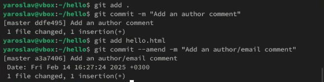{#fig:012 width=70%}

## Git внутри: Каталог .git 

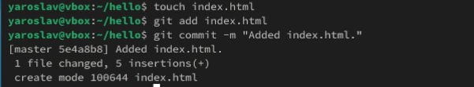{#fig:013 width=70%}

## Работа непосредственно с объектами git 

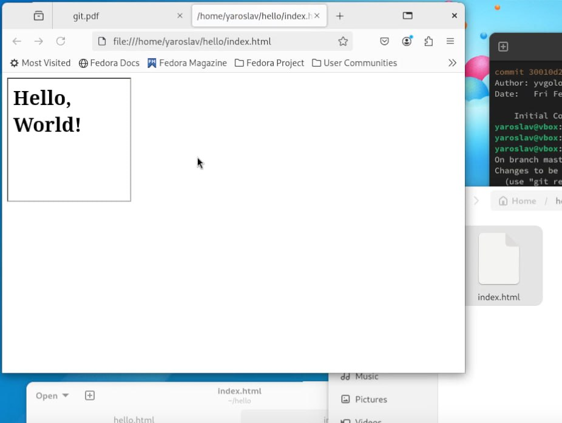{#fig:014 width=70%}

## Создание ветки

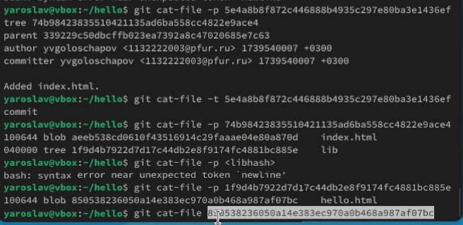{#fig:015 width=70%}

## Навигация по веткам 

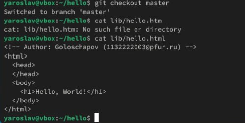{#fig:016 width=70%}

## Изменения в ветке master 

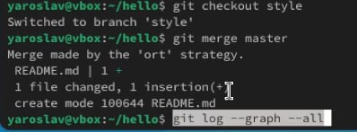{#fig:017 width=70%}

## Слияние веток 

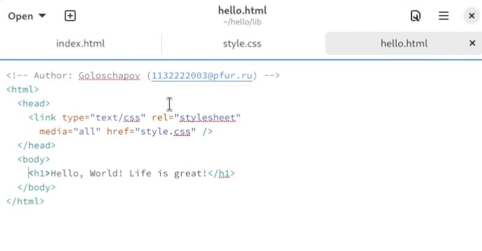{#fig:018 width=70%}

## Создание конфликта 

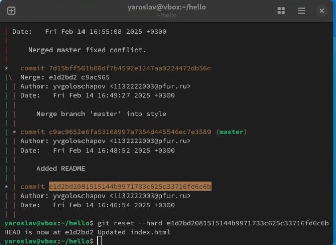{#fig:019 width=70%}

## Разрешение конфликтов

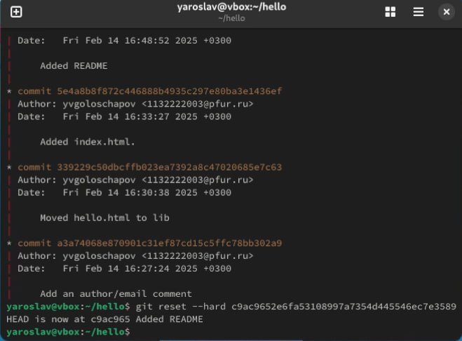{#fig:020 width=70%}

## Сброс ветки style

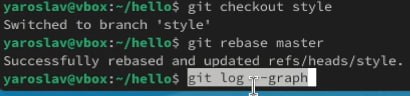{#fig:021 width=70%}

## Сброс ветки master 

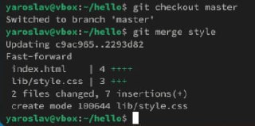{#fig:022 width=70%}

## Перебазирование 

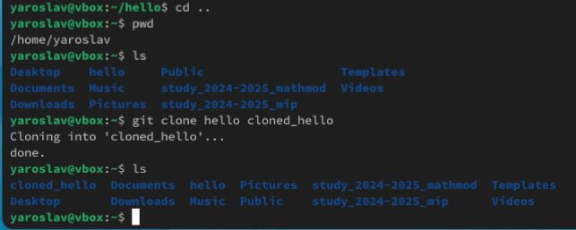{#fig:023 width=70%}

## Слияние в ветку master

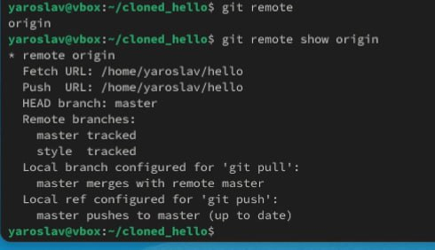{#fig:024 width=70%}

## Клонирование и просмотр репозиториев

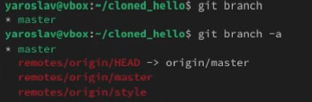{#fig:025 width=70%}

## Что такое origin? 

{#fig:026 width=70%}

## Удаленные ветки 

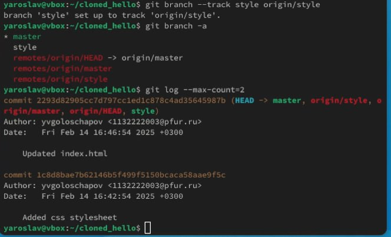{#fig:027 width=70%}

## Изменение оригинального репозитория 

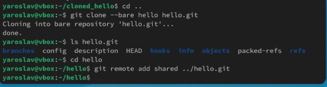{#fig:028 width=70%}

# Выводы

В этой лабораторной работе я приобрел навыки работы с git
