---
## Front matter
title: "Лабораторная работа 1"
subtitle: "Математическое моделирование"
author: "Голощапов Ярослав Вячеславович"

## Generic otions
lang: ru-RU
toc-title: "Содержание"

## Bibliography
bibliography: bib/cite.bib
csl: pandoc/csl/gost-r-7-0-5-2008-numeric.csl

## Pdf output format
toc: true # Table of contents
toc-depth: 2
lof: true # List of figures
lot: true # List of tables
fontsize: 12pt
linestretch: 1.5
papersize: a4
documentclass: scrreprt
## I18n polyglossia
polyglossia-lang:
  name: russian
  options:
	- spelling=modern
	- babelshorthands=true
polyglossia-otherlangs:
  name: english
## I18n babel
babel-lang: russian
babel-otherlangs: english
## Fonts
mainfont: IBM Plex Serif
romanfont: IBM Plex Serif
sansfont: IBM Plex Sans
monofont: IBM Plex Mono
mathfont: STIX Two Math
mainfontoptions: Ligatures=Common,Ligatures=TeX,Scale=0.94
romanfontoptions: Ligatures=Common,Ligatures=TeX,Scale=0.94
sansfontoptions: Ligatures=Common,Ligatures=TeX,Scale=MatchLowercase,Scale=0.94
monofontoptions: Scale=MatchLowercase,Scale=0.94,FakeStretch=0.9
mathfontoptions:
## Biblatex
biblatex: true
biblio-style: "gost-numeric"
biblatexoptions:
  - parentracker=true
  - backend=biber
  - hyperref=auto
  - language=auto
  - autolang=other*
  - citestyle=gost-numeric
## Pandoc-crossref LaTeX customization
figureTitle: "Рис."
tableTitle: "Таблица"
listingTitle: "Листинг"
lofTitle: "Список иллюстраций"
lotTitle: "Список таблиц"
lolTitle: "Листинги"
## Misc options
indent: true
header-includes:
  - \usepackage{indentfirst}
  - \usepackage{float} # keep figures where there are in the text
  - \floatplacement{figure}{H} # keep figures where there are in the text
---

# Цель работы

Приобретение навыков работы с git

# Задание

Получить практические навыки на примерах

# Выполнение лабораторной работы

Создаем страницу hello, world(рис. [-@fig:001]).

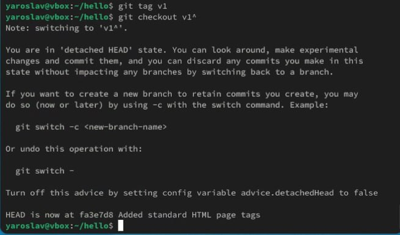{#fig:001 width=70%}

Внесение изменений в созданную страницу(рис. [-@fig:002]).

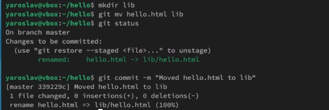{#fig:002 width=70%}

Индексация и коммит изменений(рис. [-@fig:003]).

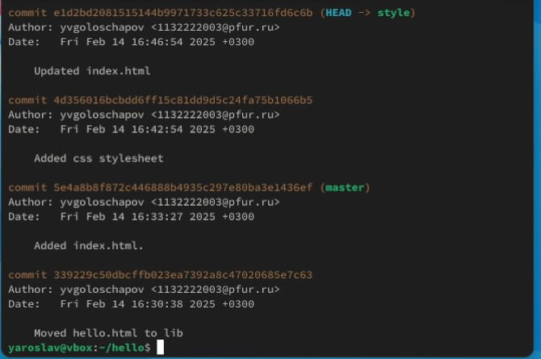{#fig:003 width=70%}

 Получение старых версий и создание тегов(рис. [-@fig:004]). 

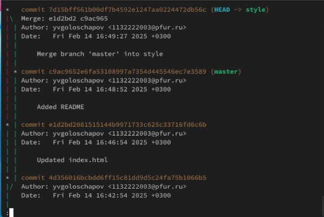{#fig:004 width=70%}

Отмена локальных изменений (до индексации) (рис. [-@fig:005])

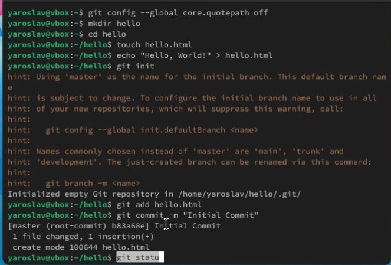{#fig:005 width=70%}

Отмена проиндексированных изменений (перед коммитом) (рис. [-@fig:006]) 

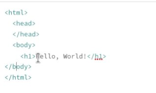{#fig:006 width=70%}

Отмена коммитов(рис. [-@fig:007])

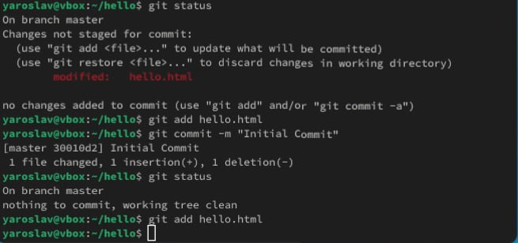{#fig:007 width=70%}

Удаление коммиттов из ветки(рис. [-@fig:008])

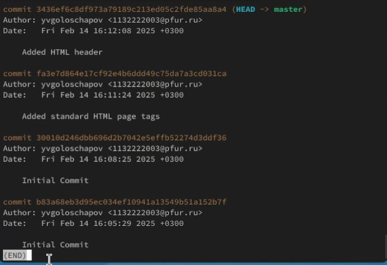{#fig:008 width=70%}

Удаление тега oops(рис. [-@fig:009])

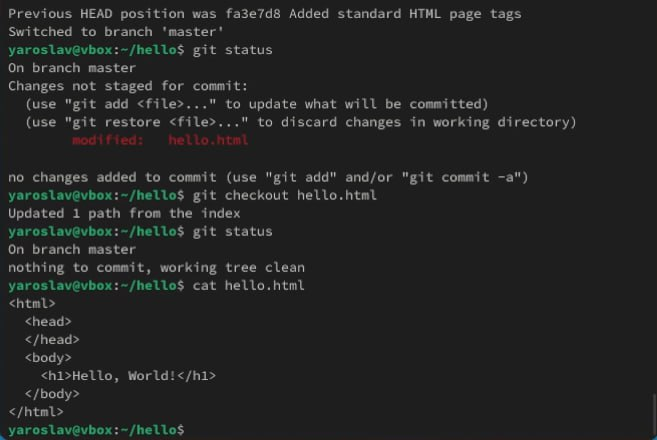{#fig:009 width=70%}

Внесение изменений в коммиты(рис. [-@fig:010])

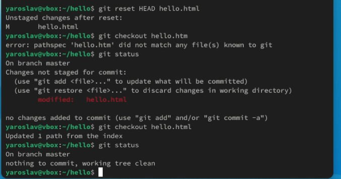{#fig:010 width=70%}

Перемещение файлов(рис. [-@fig:011])

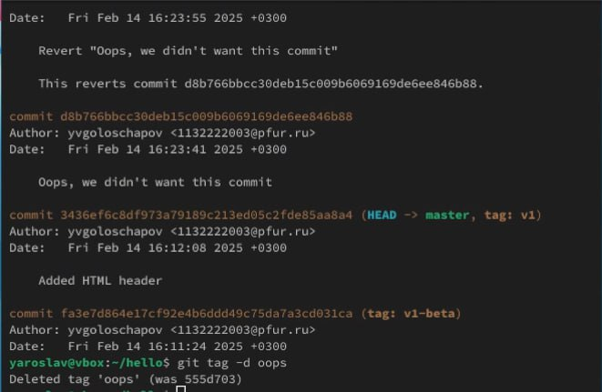{#fig:011 width=70%}

Второй способ перемещения файлов(рис. [-@fig:012])

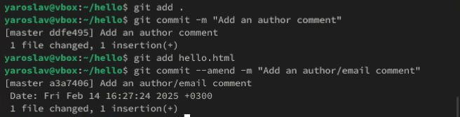{#fig:012 width=70%}

Git внутри: Каталог .git (рис. [-@fig:013])

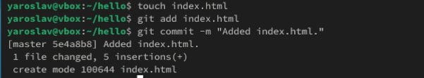{#fig:013 width=70%}

Работа непосредственно с объектами git (рис. [-@fig:014])

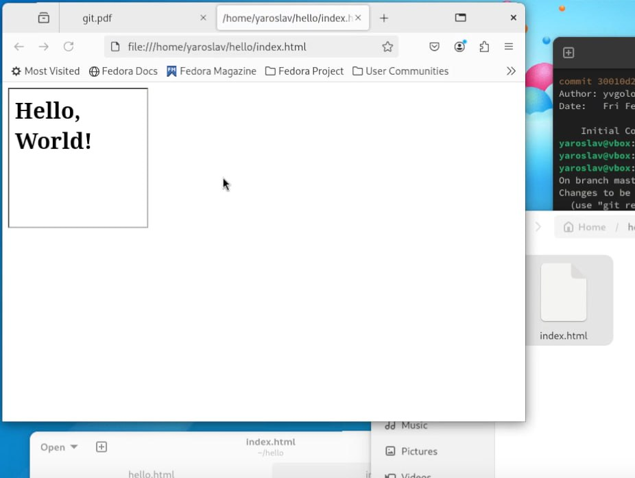{#fig:014 width=70%}

Создание ветки (рис. [-@fig:015])

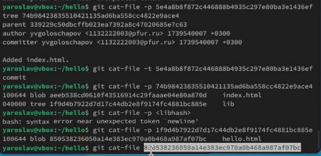{#fig:015 width=70%}

Навигация по веткам (рис. [-@fig:016])

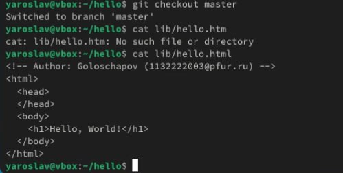{#fig:016 width=70%}

Изменения в ветке master (рис. [-@fig:017])

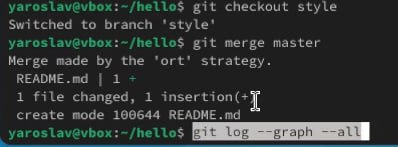{#fig:017 width=70%}

Слияние веток (рис. [-@fig:018])

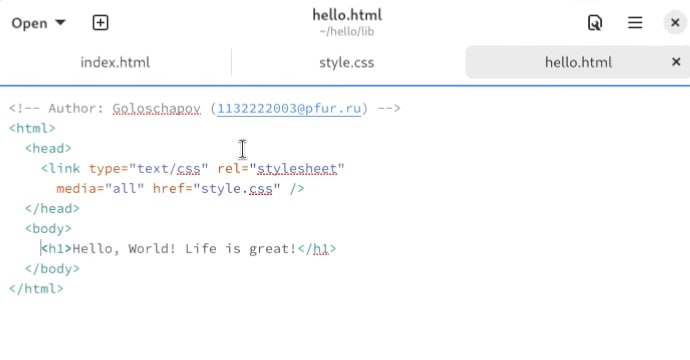{#fig:018 width=70%}

Создание конфликта (рис. [-@fig:019])

{#fig:019 width=70%}

Разрешение конфликтов (рис. [-@fig:020])

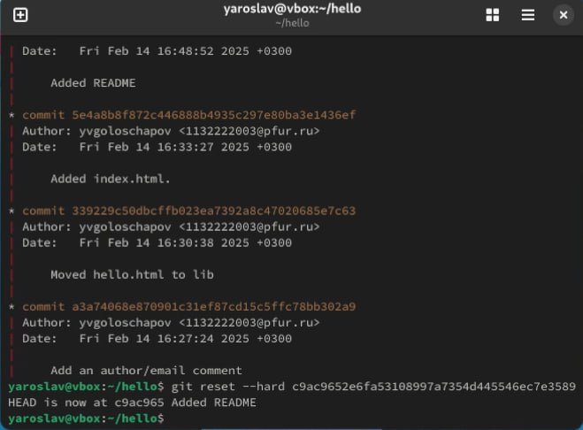{#fig:020 width=70%}

Сброс ветки style (рис. [-@fig:021])

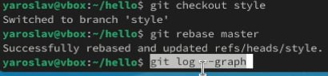{#fig:021 width=70%}

Сброс ветки master (рис. [-@fig:022])

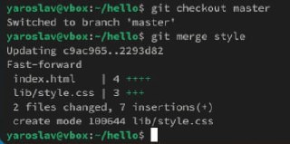{#fig:022 width=70%}

Перебазирование (рис. [-@fig:023])

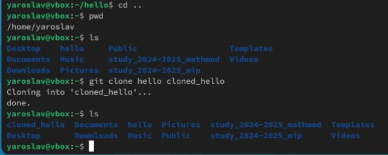{#fig:023 width=70%}

Слияние в ветку master (рис. [-@fig:024])

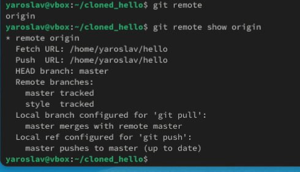{#fig:024 width=70%}

Клонирование и просмотр репозиториев(рис. [-@fig:025])

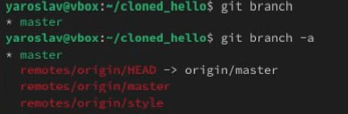{#fig:025 width=70%}

Что такое origin? (рис. [-@fig:026])

{#fig:026 width=70%}

Удаленные ветки (рис. [-@fig:027])

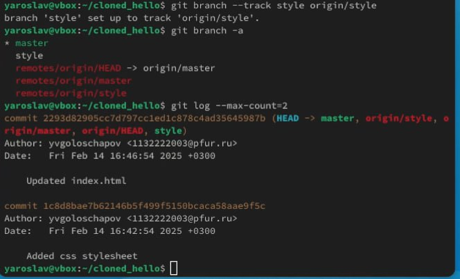{#fig:027 width=70%}

Изменение оригинального репозитория (рис. [-@fig:028])

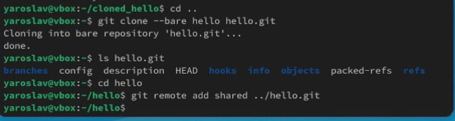{#fig:028 width=70%}

# Выводы

В этой лабораторной работе я приобрел навыки работы с git

