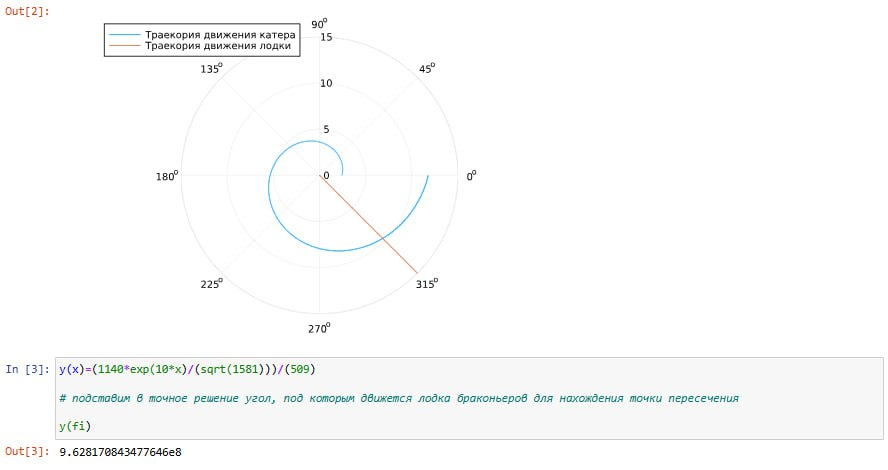
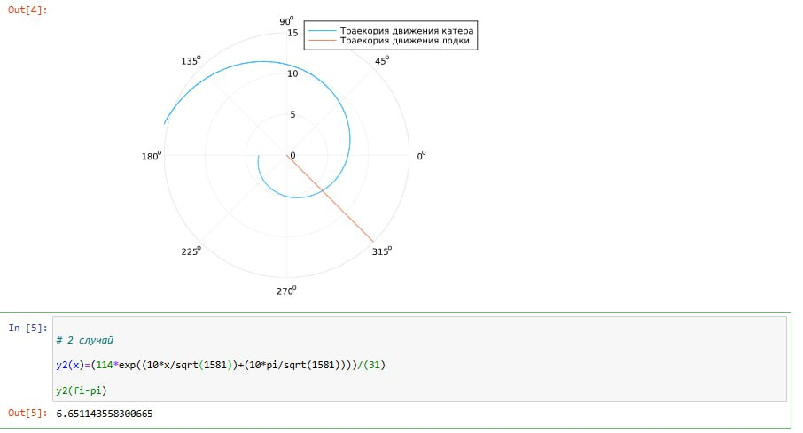

---
## Front matter
lang: ru-RU
title: Лабораторная работа 2
subtitle: Математическое моделирование
author:
  - Голощапов Ярослав Вячеславович
institute:
  - Российский университет дружбы народов, Москва, Россия
date: 15 февраля 2025

## i18n babel
babel-lang: russian
babel-otherlangs: english

## Formatting pdf
toc: false
toc-title: Содержание
slide_level: 2
aspectratio: 169
section-titles: true
theme: metropolis
header-includes:
 - \metroset{progressbar=frametitle,sectionpage=progressbar,numbering=fraction}
---

# Информация

## Докладчик

:::::::::::::: {.columns align=center}
::: {.column width="70%"}

  * Голощапов Ярослав Вячеславович
  * студент 3 курса
  * Российский университет дружбы народов
  * [1132222003@pfur.ru](mailto:1132222003@pfur.ru)
  * <https://yvgoloschapov.github.io/ru/>

:::
::: {.column width="30%"}

:::
::::::::::::::

## Цель работы

Построить математическую модель для выбора правильной стратегии при решении примера задаче о погоне. 

## Задание

На море в тумане катер береговой охраны преследует лодку браконьеров.
Через определенный промежуток времени туман рассеивается, и лодка
обнаруживается на расстоянии 8,5 км от катера. Затем лодка снова скрывается в
тумане и уходит прямолинейно в неизвестном направлении. Известно, что скорость
катера в 3,5 раза больше скорости браконьерской лодки.
1. Запишите уравнение, описывающее движение катера, с начальными
условиями для двух случаев (в зависимости от расположения катера
относительно лодки в начальный момент времени).
2. Постройте траекторию движения катера и лодки для двух случаев.
3. Найдите точку пересечения траектории катера и лодки

# Выполнение лабораторной работы

Запишем уравнение, описывающее движение катера, с начальными условиями для двух случаев (в зависимости от расположения катера относительно лодки в начальный момент времени).

Принимем за $$t_0 = 0$$, $$x_0 = 0$$ — место нахождения лодки браконьеров в момент обнаружения, $$x_{k0} = k$$ — место нахождения катера береговой охраны относительно лодки браконьеров в момент обнаружения лодки.

Введем полярные координаты. Считаем, что полюс — это точка обнаружения лодки браконьеров $$x_{k0} (\theta = x_{k0} = 0)$$, а полярная ось $$r$$ проходит через точку нахождения катера береговой охраны.

##

Траектория катера должна быть такой, чтобы и катер, и лодка все время были на одном расстоянии от полюса $$\theta$$, только в этом случае траектория катера пересечется с траекторией лодки. Поэтому для начала катер береговой охраны должен двигаться некоторое время прямолинейно, пока не окажется на том же расстоянии от полюса, что и лодка браконьеров. После этого катер береговой охраны должен двигаться вокруг полюса, удаляясь от него с той же скоростью, что и лодка браконьеров.

##

Чтобы найти расстояние $$x$$ (расстояние, после которого катер начнет двигаться вокруг полюса), необходимо составить простое уравнение. Пусть через время $$t$$ катер и лодка окажутся на одном расстоянии $$x$$ от полюса. За это время лодка пройдет $$x$$, а катер $$k - x$$ (или $$k + x$$, в зависимости от начального положения катера относительно полюса). Время, за которое они пройдут это расстояние, вычисляется как $$\frac{x}{v}$$ или $$\frac{k - x}{3.5v}$$ (во втором случае $$\frac{k + x}{3.5v}$$). Так как время одно и то же, то эти величины одинаковы. Тогда неизвестное расстояние $$x$$ можно найти из следующего уравнения:

$$\frac{x}{v} = \frac{k - x}{3.5v}$$ — в первом случае

$$\frac{x}{v} = \frac{k + x}{3.5v}$$ — во втором

##

Отсюда мы найдем два значения $$x_1 = \frac{8.5}{3.5}$$ и $$x_2 = \frac{8.5}{2.5}$$, задачу будем решать для двух случаев.

После того, как катер береговой охраны окажется на одном расстоянии от полюса, что и лодка, он должен сменить прямолинейную траекторию и начать двигаться вокруг полюса, удаляясь от него со скоростью лодки $$v$$. Для этого скорость катера раскладываем на две составляющие: $$v_r$$ — радиальная скорость и $$v_\tau$$ — тангенциальная скорость. Радиальная скорость — это скорость, с которой катер удаляется от полюса, $$v_r = \frac{dr}{dt}$$. Нам нужно, чтобы эта скорость была равна скорости лодки, поэтому полагаем $$\frac{dr}{dt} = v$$.

##

Тангенциальная скорость — это линейная скорость вращения катера относительно полюса. Она равна произведению угловой скорости $$\frac{d\theta}{dt}$$ на радиус $$r$$, $$r\frac{d\theta}{dt}$$.

Получаем:

$$v_\tau = \sqrt{3.5v^2 - v^2} = \sqrt{2.5v^2} = \sqrt{2.5}v$$

Из чего можно вывести:

$$r\frac{d\theta}{dt} = \sqrt{2.5}v$$

##

Решение исходной задачи сводится к решению системы из двух дифференциальных уравнений:

$$
\begin{cases}
\frac{dr}{dt} = v \\
r\frac{d\theta}{dt} = \sqrt{2.5}v
\end{cases}
$$

##

С начальными условиями для первого случая:

$$
\begin{cases}
\theta_0 = 0 \\
r_0 = \frac{8.5}{3.5}
\end{cases}
$$

##

Или для второго:

$$
\begin{cases}
\theta_0 = -\pi \\
r_0 = \frac{8.5}{2.5}
\end{cases}
$$

##

Исключая из полученной системы производную по $$t$$, можно перейти к следующему уравнению:

$$\frac{dr}{d\theta} = \frac{r}{\sqrt{2.5}}$$

Начальные условия остаются прежними. Решив это уравнение, мы получим траекторию движения катера в полярных координатах

## Вывод траекторий движения катера и лодки, а также точка пересечения для первого случая.

{#fig:001 width=70%}

## Вывод траекторий движения катера и лодки, а также точка пересечения для второго случая .

{#fig:002 width=70%}

## Выводы

В этой лабораторной работе я построил математическую модель для выбора правильной стратегии при решении примера задаче о погоне. 
