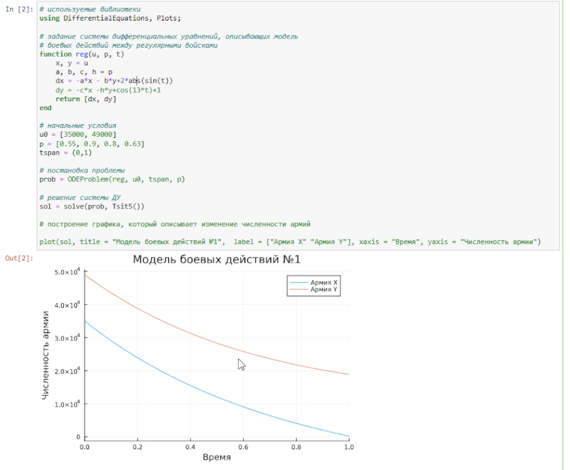
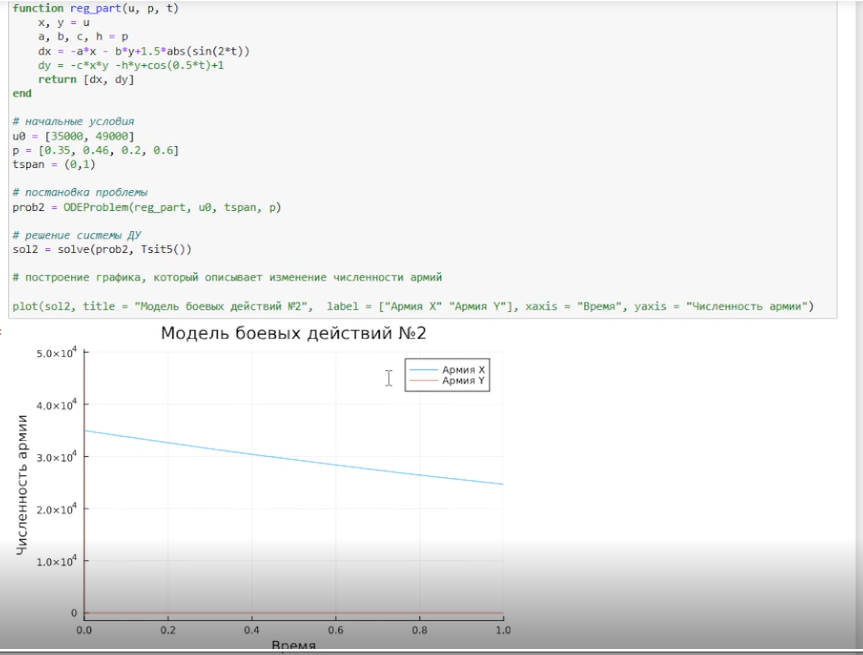

---
## Front matter
title: "Лабораторная работа 3"
subtitle: "Математическое моделирование"
author: "Голощапов Ярослав Вячеславович"

## Generic otions
lang: ru-RU
toc-title: "Содержание"

## Bibliography
bibliography: bib/cite.bib
csl: pandoc/csl/gost-r-7-0-5-2008-numeric.csl

## Pdf output format
toc: true # Table of contents
toc-depth: 2
lof: true # List of figures
lot: true # List of tables
fontsize: 12pt
linestretch: 1.5
papersize: a4
documentclass: scrreprt
## I18n polyglossia
polyglossia-lang:
  name: russian
  options:
	- spelling=modern
	- babelshorthands=true
polyglossia-otherlangs:
  name: english
## I18n babel
babel-lang: russian
babel-otherlangs: english
## Fonts
mainfont: IBM Plex Serif
romanfont: IBM Plex Serif
sansfont: IBM Plex Sans
monofont: IBM Plex Mono
mathfont: STIX Two Math
mainfontoptions: Ligatures=Common,Ligatures=TeX,Scale=0.94
romanfontoptions: Ligatures=Common,Ligatures=TeX,Scale=0.94
sansfontoptions: Ligatures=Common,Ligatures=TeX,Scale=MatchLowercase,Scale=0.94
monofontoptions: Scale=MatchLowercase,Scale=0.94,FakeStretch=0.9
mathfontoptions:
## Biblatex
biblatex: true
biblio-style: "gost-numeric"
biblatexoptions:
  - parentracker=true
  - backend=biber
  - hyperref=auto
  - language=auto
  - autolang=other*
  - citestyle=gost-numeric
## Pandoc-crossref LaTeX customization
figureTitle: "Рис."
tableTitle: "Таблица"
listingTitle: "Листинг"
lofTitle: "Список иллюстраций"
lotTitle: "Список таблиц"
lolTitle: "Листинги"
## Misc options
indent: true
header-includes:
  - \usepackage{indentfirst}
  - \usepackage{float} # keep figures where there are in the text
  - \floatplacement{figure}{H} # keep figures where there are in the text
---

# Цель работы

Построение моделей боевых действий

# Задание

Вариант 4
  
Между страной $X$ и страной $Y$ идет война. Численность состава войск
исчисляется от начала войны, и являются временными функциями $x(t)$ и $y(t)$. В
начальный момент времени страна $X$ имеет армию численностью 35 000 человек,
а в распоряжении страны $Y$ армия численностью в 49 000 человек. Для упрощения
модели считаем, что коэффициенты $a, b, c, h$ постоянны. Также считаем $P(t)$ и $Q(t)$ непрерывные функции.

Построить графики изменения численности войск армии $X$ и армии $Y$ для  следующих случаев:

1. Модель боевых действий между регулярными войсками
$$\begin{cases}
    \dfrac{dx}{dt} = -0.55x(t)- 0.9y(t)+2|sin(t)|\\
    \dfrac{dy}{dt} = -0.8x(t)- 0.63y(t)+cos(13t)+1
\end{cases}$$

2. Модель ведение боевых действий с участием регулярных войск и партизанских отрядов

$$\begin{cases}
    \dfrac{dx}{dt} = -0.35x(t)-0.46y(t)+1.5|sin(2t)|\\
    \dfrac{dy}{dt} = -0.2x(t)y(t)-0.6y(t)+cos(0.5t)+1
\end{cases}$$

# Теоретическое введение 

Законы Ланчестера (законы Осипова — Ланчестера) — математическая формула для расчета относительных сил пары сражающихся сторон — подразделений вооруженных сил. В статье «Влияние численности сражающихся сторон на их потери», опубликованной журналом «Военный сборник» в 1915 году, генерал-майор Корпуса военных топографов М. П. Осипов описал математическую модель глобального вооружённого противостояния, практически применяемую в военном деле при описании убыли сражающихся сторон с течением времени и, входящую в математическую теорию исследования операций, на год опередив английского математика Ф. У. Ланчестера. Мировая война, две революции в России не позволили новой власти заявить в установленном в научной среде порядке об открытии царского офицера.

Уравнения Ланчестера — это дифференциальные уравнения, описывающие зависимость между силами сражающихся сторон A и D как функцию от времени, причем функция зависит только от A и D.

В 1916 году, в разгар первой мировой войны, Фредерик Ланчестер разработал систему дифференциальных уравнений для демонстрации соотношения между противостоящими силами. Среди них есть так называемые Линейные законы Ланчестера (первого рода или честного боя, для рукопашного боя или неприцельного огня) и Квадратичные законы Ланчестера (для войн начиная с XX века с применением прицельного огня, дальнобойных орудий, огнестрельного оружия). В связи с установленным приоритетом в англоязычной литературе наметилась тенденция перехода от фразы «модель Ланчестера» к «модели Осипова — Ланчестера» [@wiki:bash].

# Выполнение лабораторной работы

## Модель боевых действий между регулярными войсками

Строим модель на языке Julia и получаем график для первого варианта (рис. [-@fig:001]). 

{#fig:001 width=70%}

Из графика видно, чтол выиграла армия страны  Y, поскольку численность армии страны X стала 0, а потом и вообще ушла в отрицательную часть графика. Потери страны Y можно считать незначительными.

## Модель ведение боевых действий с участием регулярных войск и партизанских отрядов

Строим модель на языке Julia и получаем график для первого варианта (рис. [-@fig:002]) 

{#fig:002 width=70%}

# Выводы

В этой лабораторной работе я приобрел навыки построения моделей боевых действий

